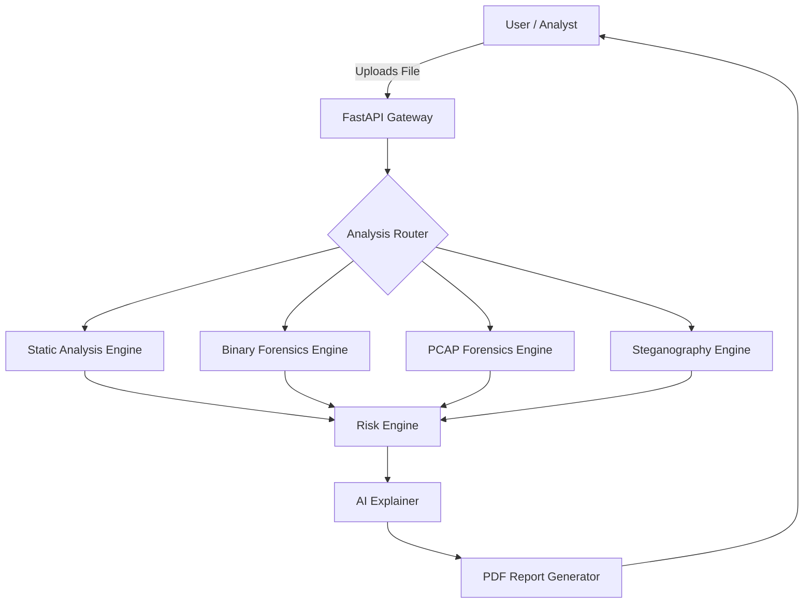

# 🛡️ CyberSentinel

## AI-Powered Malware Analysis Engine

CyberSentinel is an **advanced, multi-modal security analysis platform** engineered to detect **zero-day threats, obfuscated payloads, and malicious artifacts** across source code, binaries, network traffic, and media files.

Unlike traditional antivirus solutions that rely primarily on file hashes and static signatures, CyberSentinel **deconstructs program logic, decodes layered obfuscation, inspects executable internals, analyzes network traffic, and correlates behaviors with the MITRE ATT&CK framework** to deliver explainable, enterprise-grade threat intelligence.

---

## 🚀 Key Capabilities

### 🧠 1. Universal Static Analysis Engine

Powered by a **custom Abstract Syntax Tree (AST) parser** combined with a **context-aware regex engine**, CyberSentinel identifies language-specific threats with high precision.

**Supported Languages (20+)**
Python, JavaScript, C, C++, Java, Go, Rust, PHP, PowerShell, Bash, Ruby, Perl, C#, SQL, Batch, VBScript, Lua, R, Dockerfile, and more.

**Deep Logic Inspection**

* Detects dangerous execution sinks: `eval()`, `exec()`, `system()`
* Flags process injection techniques:

  * `VirtualAlloc`
  * `CreateRemoteThread`
* Identifies reverse shells and persistence mechanisms
* Tracks control-flow abuse and suspicious logic patterns

---

### 🔍 2. Binary Forensics (PE & Executables)

A dedicated engine for analyzing **compiled Windows artifacts** (`.exe`, `.dll`) without execution.

* **PE Header Analysis**

  * Entry-point anomalies
  * TimeStomping (forged compilation timestamps)

* **Section Inspection**

  * Packed malware detection (High Entropy > 7.0)
  * Writable + Executable (RWX) memory regions

* **Import Hashing**

  * Flags suspicious API imports such as `CryptEncrypt`, `ShellExecute`

* **String Extraction**

  * ASCII & Unicode strings
  * C2 IPs, URLs, registry paths, and hard-coded credentials

---

### 📡 3. Network Forensics (PCAP Analysis)

Analyzes packet capture files (`.pcap`) to detect **command-and-control traffic, lateral movement, and reconnaissance activity**.

* **Protocol Analysis**

  * Identifies insecure protocols (Telnet, FTP, HTTP)

* **C2 Beacon Detection**

  * Suspicious User-Agents (Metasploit, Empire, Cobalt Strike)

* **Port & Scan Detection**

  * Nmap-style scans
  * Non-standard ports (4444, 6667, etc.)

---

### 🖼️ 4. Steganography Detection

Inspects image files (`.jpg`, `.png`) for **hidden payloads and covert channels**.

* **LSB (Least Significant Bit) Analysis**
* **Metadata Forensics**

  * Injected PHP / shellcode tags in EXIF data
* **Polyglot Detection**

  * Files masquerading as both images and executables/scripts

---

### 📊 5. Intelligence, Scoring & Reporting

* **8-Axis Risk Radar**

  * Execution
  * Persistence
  * Privilege Escalation
  * Defense Evasion
  * Credential Access
  * Discovery
  * Lateral Movement
  * Impact

* **Heuristic Risk Scoring (0–100)**

  * Behavior-weighted scoring
  * Deterministic & explainable

* **MITRE ATT&CK Mapping**

  * Automatic TTP classification

* **VirusTotal Integration**

  * SHA-256 hashing
  * Reputation lookup across 70+ engines

* **PDF Forensics Report (Legal-Grade)**

  * Executive risk summary
  * Kill-chain score
  * Evidence snippets (source code / hex dump)
  * AI-generated verdict

---

## 🤖 AI Explainability Layer

* Converts raw detections into **human-readable explanations**
* Line-level reasoning for suspicious logic
* Interactive queries such as:

  * “Why is this flagged?”
  * “What does this line do?”

---

## 🛠️ System Architecture

The system follows a **microservice-ready, stateless architecture**, separating analysis logic from API routing.



---

## 📂 Project Structure

```
CYBERSENTINEL/
│
├── frontend/
│   ├── index.html            # Dashboard UI
│   ├── dashboard.html        # Landing page
│   ├── app.js                # Frontend logic & API calls
│   └── style.css             # Dark-mode styling
│
└── backend/
    ├── main.py               # Application entry point
    ├── requirements.txt      # Dependencies
    │
    ├── analyzer/             # Core analysis engine
    │   ├── static_analyzer.py
    │   ├── binary_analyzer.py
    │   ├── pcap_analyzer.py
    │   ├── stego_analyzer.py
    │   ├── deobfuscator.py
    │   ├── risk_engine.py
    │   ├── mitre_mapping.py
    │   ├── virustotal.py
    │   ├── report_generator.py
    │   └── utils.py
    │
    └── routes/
        └── analyze.py         # API endpoints
```

---

## ⚡ Installation & Setup

### ✅ Prerequisites

* Python 3.10+
* Git

### 1️⃣ Clone Repository

```bash
git clone https://github.com/yourusername/cybersentinel.git
cd cybersentinel
```

### 2️⃣ Backend Setup

```bash
cd backend
python -m venv venv

# Activate
# Windows
venv\Scripts\activate
# Linux / macOS
source venv/bin/activate

pip install -r requirements.txt
```

### 3️⃣ Optional External Keys

Create `.env` in `backend/`:

```
VIRUSTOTAL_API_KEY=your_api_key_here
```

### 4️⃣ Run the Engine

```bash
python main.py
```

Server runs at: `http://127.0.0.1:8001`

### 5️⃣ Access Dashboard

Open in browser:

```
http://127.0.0.1:8001
```

---

## 🧪 Validated Test Scenarios

| Threat Vector | Example                             | Detection Module |
| ------------- | ----------------------------------- | ---------------- |
| Reverse Shell | `nc -e /bin/sh`                     | Static / Network |
| Ransomware    | File encryption logic               | Static / Binary  |
| Steganography | Hidden payload in JPG               | Stego Analyzer   |
| C2 Beacon     | HTTP traffic on port 4444           | Network          |
| Injection     | `VirtualAlloc + CreateRemoteThread` | Binary / Static  |
| Obfuscation   | Base64 payloads                     | Deobfuscator     |
| Persistence   | Registry Run Keys                   | Risk Engine      |

---

## 🔮 Future Roadmap

* [ ] Dynamic sandbox execution
* [ ] Machine-learning-based PE classification
* [ ] Dockerized deployments
* [ ] CI/CD commit scanning integration

---

## 📄 License

MIT License

---

<div align="center">
<sub>Built with ❤️ by <strong>CyberSentinel Team</strong></sub>
</div>
